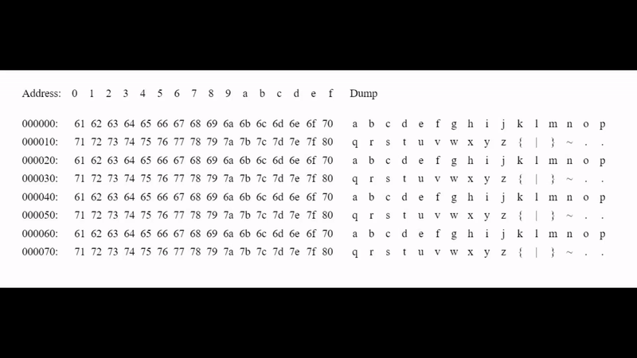

# Hex Color Display
<!-- ALL-CONTRIBUTORS-BADGE:START - Do not remove or modify this section -->
[](#contributors-)
<!-- ALL-CONTRIBUTORS-BADGE:END -->

NPM package to help you read a binary file with a structured format. On hover mouse the block is highlighted and a tooltip is popped up to explain each section.

<!--  -->



## Example:
```js
import React from 'react';
import HexColorDisplay from 'hex-color-displayer'

const data_example = [
    {
        "start": 0,
        "end": 13,
        "name": "Header",
        "color": "", // Color feature has not yet implemented
        "sublist": []
    },
    {
        "start": 13,
        "end": 32,
        "name": "data",
        "color": "", 
        "sublist": []
    },
]

const raw = [97, 98, 99, 100, 101, 102, 103, 104, 105, 106,
		107, 108, 109, 110, 111, 112, 113, 114, 115, 116, 117,
		118, 119, 120, 121, 122, 123, 124, 125, 126, 127, 128]
React.render(<HexColorDisplay 
        offsets={data_example} bin={raw} />, document.body);
```

### Storybook example
In storybook I added an example you can use to see how it works and debug this package.

## Contributing
The contributing guidelines are [here](.github/CONTRIBUTING.md)

## Contributors ✨

Thanks goes to these wonderful people ([emoji key](https://allcontributors.org/docs/en/emoji-key)):

<!-- ALL-CONTRIBUTORS-LIST:START - Do not remove or modify this section -->
<!-- prettier-ignore-start -->
<!-- markdownlint-disable -->
<table>
  <tr>
    <td align="center"><a href="https://github.com/aradbivas"><br /><sub><b>Arad Bivas</b></sub></a><br /><a href="https://github.com/dolby360/hex_color_displayer/commits?author=aradbivas" title="Code">💻</a></td>
    <td align="center"><a href="https://github.com/vov62"><br /><sub><b>avi vovgen</b></sub></a><br /><a href="https://github.com/dolby360/hex_color_displayer/commits?author=vov62" title="Code">💻</a></td>
    <td align="center"><a href="https://github.com/TomDamri1"><br /><sub><b>Tom</b></sub></a><br /><a href="https://github.com/dolby360/hex_color_displayer/commits?author=TomDamri1" title="Code">💻</a></td>
  </tr>
</table>

<!-- markdownlint-restore -->
<!-- prettier-ignore-end -->

<!-- ALL-CONTRIBUTORS-LIST:END -->

This project follows the [all-contributors](https://github.com/all-contributors/all-contributors) specification. Contributions of any kind welcome!